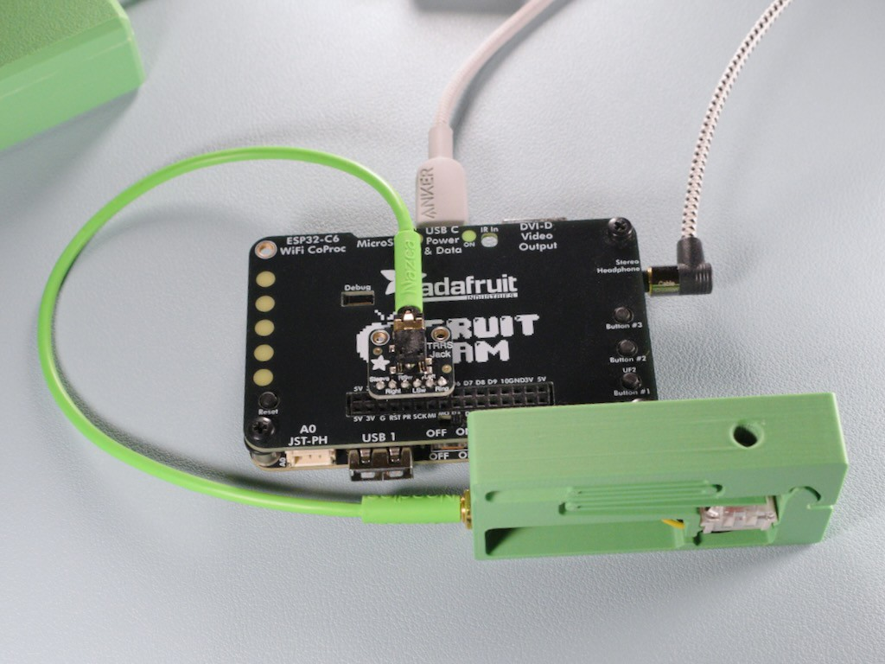
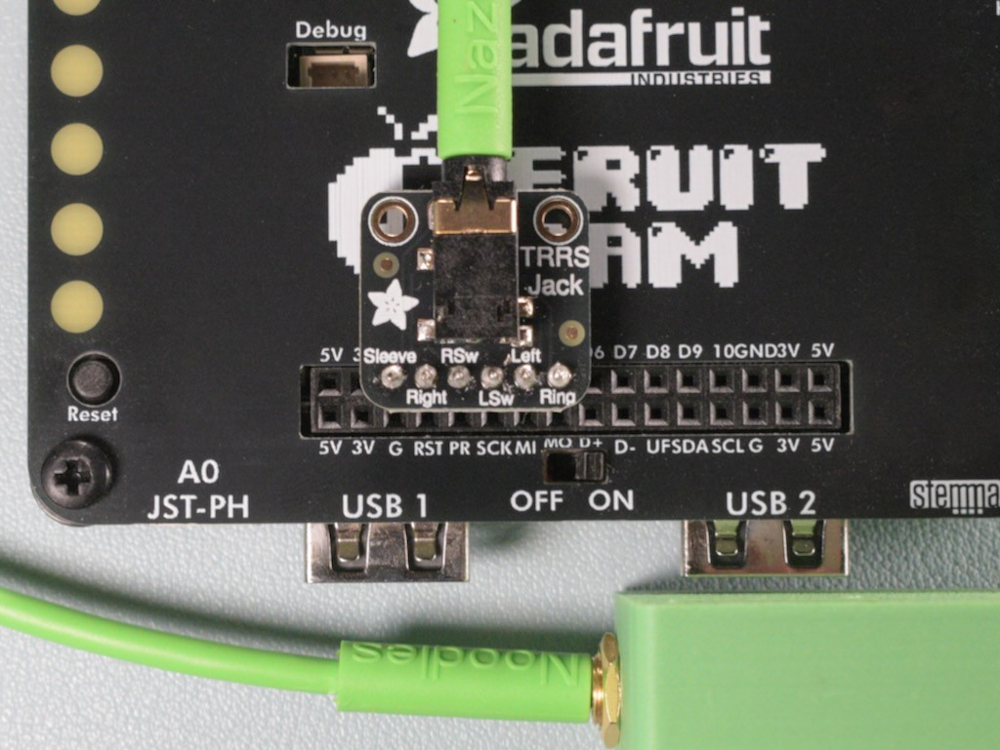

<!-- SPDX-License-Identifier: MIT -->
<!-- SPDX-FileCopyrightText: Copyright 2026 Sam Blenny -->
# Fruit Jam Code Practice Oscillator



Morse code practice oscillator for Fruit Jam with 3d-printable mx straight key.


## Hardware

- [Adafruit Fruit Jam](https://www.adafruit.com/product/6200)
- [Adafruit TRRS Jack Breakout Board](https://www.adafruit.com/product/5764)
- [3.5mm Male/Male Stereo Cable](https://www.adafruit.com/product/2698)
- [Panel Mount 3.5mm TRS Audio Jack](https://www.adafruit.com/product/3692)
- [30 AWG Silicone Stranded-Core Wire, Black](https://www.adafruit.com/product/2003)
- [30 AWG Silicone Stranded-Core Wire, Yellow](https://www.adafruit.com/product/2004)
- [Kailh Mechanical Key Switches - Linear Red](https://www.adafruit.com/product/4952)
- M5x8mm set screw


## 3D Printing

Blender and STL files are in the [morse_keys](folder). The MX straight key
frame uses flexure springs that are fine to print in PLA. I used a the standard
Bambu Studio 0.2mm layer height preset with the exceptions of calibrating my
X-Y hole compensation, slowing down the maximum acceleration, and increasing
the walls from 2 to 3 (but 2 probably would have been fine).


## Wiring

**CAUTION:** Be very careful about alignment when plugging the TRRS jack
breakout board into the GPIO port. Make sure to put **Sleeve in GND** and
**Ring in A5**. DO NOT plug Sleeve into 3V, which is right next to GND! If you
line the board up off by one pin, you may end up shorting 3V to GND when you
plug in the key.




Fruit Jam Wiring:

```
  Fruit Jam
  GPIO Port
+-----+-----+     TRRS Jack
| 5V  |  5V |     Breakout
| 3V  |  3V |    +----------------+
| G   | GND |----| Sleeve         |   <- Sleeve: GND
| RST |  A1 |----| Right +-------+|
| PR  |  A2 |----| RSw   +       +-+
| SCK |  A3 |----| LSw   +       +-+
| MI  |  A4 |----| Left  +-------+|   <- Left: Tip (input w/ pullup)
| MO  |  A5 |----| Ring           |
| D+  |  D6 |    +----------------+
| D-  |  D7 |
| UF  |  D8 |
| SDA |  D9 |
| SCL |  10 |
| G   | GND |
| 3V  |  3V |
| 5V  |  5V |
+-----+-----+
```


MX Straight Key Wiring:

```
TRS Headphone Jack               Cherry MX Compatible Key Switch

                                            ||
                                        /--+||+--\
     +----------+                      /          \
     |   \/-----|--- 3 Right           ============
+~~~~+          |                 black   |   |
|---------------|----- 1 Sleeve ----------+   +
+~~~~+          |                             |
     |      /\--|--- 2 Left (Tip) ------------+
     +----------|                    yellow
```
